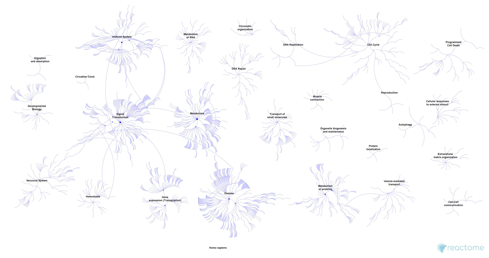

# ReactomeContentService4R: an R interface for the Reactome Content Service

<!-- badges: start -->
[](https://www.repostatus.org/#active)
[](https://travis-ci.com/reactome/ReactomeContentService4R)
<!-- badges: end -->

The `ReactomeContentService4R` package provides a wrapper for the Reactome Content Service.


## Installation
```
# Pick one
## from Bioconductor (>= 3.13)
if (!requireNamespace("BiocManager", quietly = TRUE))
    install.packages("BiocManager")

BiocManager::install("ReactomeContentService4R")

## from github
devtools::install_github("reactome/ReactomeContentService4R")
remotes::install_github("reactome/ReactomeContentService4R")
```

⚠️ If you are using [RStudio](https://rstudio.com/products/rstudio/download/) on macOS, make sure the version is __>= 1.3.1056__.

## Documentation
- [__Vignette__](https://bioconductor.org/packages/release/bioc/vignettes/ReactomeContentService4R/inst/doc/ReactomeContentService4R.html)
- [__Reactome Content Service__](https://reactome.org/dev/content-service)

## Usage
Fetch the information for a Reactome object:
```r
library(ReactomeContentService4R)
#> Connecting...welcome to Reactome v74!

dbp <- query(id = 'R-HSA-879796')
str(dbp, max.level = 1)
#> List of 18
#>  $ dbId           : int 879796
#>  $ displayName    : chr "DBP [nucleoplasm]"
#>  $ stId           : chr "R-HSA-879796"
#>  $ stIdVersion    : chr "R-HSA-879796.1"
#>  $ created        :List of 5
#>  $ modified       :List of 5
#>  $ name           : chr [1:3] "DBP" "D site-binding protein" "DBP_HUMAN"
#>  $ speciesName    : chr "Homo sapiens"
#>  $ compartment    :'data.frame': 1 obs. of  9 variables:
#>  $ producedByEvent:'data.frame': 1 obs. of  17 variables:
#>  $ species        : int 48887
#>  $ endCoordinate  : int 325
#>  $ referenceType  : chr "ReferenceGeneProduct"
#>  $ startCoordinate: int 1
#>  $ referenceEntity:List of 22
#>  $ className      : chr "Protein"
#>  $ inDisease      : logi FALSE
#>  $ schemaClass    : chr "EntityWithAccessionedSequence"
```

Retrieve physical entities that participate in a specific Reaction:
```r
getParticipants("R-HSA-400342", retrieval = "PhysicalEntities")
#>      dbId                                      displayName          stId
#> 1 5640173                         ARNTL gene [nucleoplasm] R-HSA-5640173
#> 2  400353                                  ARNTL [cytosol]  R-HSA-400353
#> 3 5663268        RORA:Coactivator:ARNTL gene [nucleoplasm] R-HSA-5663268
#> 4 5663269 NR1D1:heme:Corepressors:ARNTL gene [nucleoplasm] R-HSA-5663269
#> 5  427531                              SIRT1 [nucleoplasm]  R-HSA-427531
#>       stIdVersion
#> 1 R-HSA-5640173.1
#> 2  R-HSA-400353.1
#> 3 R-HSA-5663268.1
#> 4 R-HSA-5663269.1
#> 5  R-HSA-427531.1
#>                                                                                       name
#> 1                                                                               ARNTL gene
#> 2 ARNTL, BMAL1, Aryl hydrocarbon receptor nuclear translocator-like protein 1, BMAL1_HUMAN
#> 3                                                              RORA:Coactivator:ARNTL gene
#> 4                                                       NR1D1:heme:Corepressors:ARNTL gene
#> 5                                  SIRT1, NAD-dependent deacetylase sirtuin-1, SIRT1_HUMAN
#>    speciesName endCoordinate        referenceType startCoordinate    className
#> 1 Homo sapiens            -1 ReferenceDNASequence               1 DNA Sequence
#> 2 Homo sapiens           626 ReferenceGeneProduct               1      Protein
#> 3 Homo sapiens            NA                 <NA>              NA      Complex
#> 4 Homo sapiens            NA                 <NA>              NA      Complex
#> 5 Homo sapiens           747 ReferenceGeneProduct               2      Protein
#>   inDisease                   schemaClass isChimeric
#> 1     FALSE EntityWithAccessionedSequence         NA
#> 2     FALSE EntityWithAccessionedSequence         NA
#> 3     FALSE                       Complex      FALSE
#> 4     FALSE                       Complex      FALSE
#> 5     FALSE EntityWithAccessionedSequence         NA
```

Export the human fireworks image:
```r
exportImage(species = "9606", output = "fireworks", format = "jpg", quality = 8)
```


Find more examples in the [vignette](https://bioconductor.org/packages/release/bioc/vignettes/ReactomeContentService4R/inst/doc/ReactomeContentService4R.html)!

## Feedback
Any feedback is welcome! Feel free to open an [issue](https://github.com/reactome/ReactomeContentService4R/issues) on GitHub.
